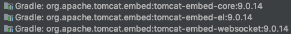

# Intro

스프링 부트에 대해 정리한다.  

# 색인

- [Intro](#intro)
- [색인](#%EC%83%89%EC%9D%B8)
- [1. 스프링 부트란?](#1-%EC%8A%A4%ED%94%84%EB%A7%81-%EB%B6%80%ED%8A%B8%EB%9E%80)
- [2. 스프링부트 자동 설정](#2-%EC%8A%A4%ED%94%84%EB%A7%81%EB%B6%80%ED%8A%B8-%EC%9E%90%EB%8F%99-%EC%84%A4%EC%A0%95)
  - [2.1 @SpringBootApplication](#21-springbootapplication)
  - [2.2 자동 설정: starter, autoconfigure](#22-%EC%9E%90%EB%8F%99-%EC%84%A4%EC%A0%95-starter-autoconfigure)
- [3. 스프링 부트 내장 웹 서버](#3-%EC%8A%A4%ED%94%84%EB%A7%81-%EB%B6%80%ED%8A%B8-%EB%82%B4%EC%9E%A5-%EC%9B%B9-%EC%84%9C%EB%B2%84)
  - [3.1 컨테이너](#31-%EC%BB%A8%ED%85%8C%EC%9D%B4%EB%84%88)
- [4. 외부 설정(Externalized Configuration)](#4-%EC%99%B8%EB%B6%80-%EC%84%A4%EC%A0%95externalized-configuration)
  - [4.1 프로퍼티 사용](#41-%ED%94%84%EB%A1%9C%ED%8D%BC%ED%8B%B0-%EC%82%AC%EC%9A%A9)
  - [4.2 테스트에서 사용](#42-%ED%85%8C%EC%8A%A4%ED%8A%B8%EC%97%90%EC%84%9C-%EC%82%AC%EC%9A%A9)
  - [4.3 type-safe property (bean 주입)](#43-type-safe-property-bean-%EC%A3%BC%EC%9E%85)
  - [4.3.1 Properties Conversion](#431-properties-conversion)
  - [4.3.2 Validation](#432-validation)
- [5. Profile](#5-profile)

# 1. 스프링 부트란?

[레퍼런스](https://docs.spring.io/spring-boot/docs/current/reference/html/getting-started-introducing-spring-boot.html)

* production-grade 애플리케이션을 만들기 쉽게 도와줌
* 빠르고 폭 넓은 사용성 제공
* 기본적으로 코드 제너레이션, XML 설정 필요 없음
* JDK 8 이상
* 의존성 관리

# 2. 스프링부트 자동 설정

부트가 지금까지 자동 설정을 어떻게 했는지 알아보자.  

## 2.1 @SpringBootApplication

이 어노테이션을 보자.  

```java
@SpringBootConfiguration  // configuration
@EnableAutoConfiguration  // bean 등록
@ComponentScan  // bean 탐색
```

@EnableAutoConfiguration
* step1: @ComponentScan
  * @Component
  * streotypes: @Configuration, @Service, @Repository, @Controller, @RestController
* step2: @EnableAutoConfiguration
  * spring-boot-autoconfigure/META-INF/spring.factories 읽음
    * 모두 @Configuration 붙음
    * 모두 다 읽지는 않고 조건(@ConditionalOnBlah)에 따라 읽음
    * 읽는 순서도 정해져있음

## 2.2 자동 설정: starter, autoconfigure

우선, 간단한 그레이들 프로젝트를 만들고 다음과 같이 설정한다. (build.gradle)

```java
plugins {
    id 'java'
}

group 'xyz.hyeyoom'
version '1.0-SNAPSHOT'

sourceCompatibility = 1.8

repositories {
    mavenCentral()
}

dependencies {
    testCompile group: 'junit', name: 'junit', version: '4.12'
    compile group: 'org.springframework.boot', name: 'spring-boot-autoconfigure', version: '2.1.3.RELEASE'
    compile group: 'org.springframework.boot', name: 'spring-boot-autoconfigure-processor', version: '2.1.3.RELEASE'
    compile group: 'org.springframework.boot', name: 'spring-boot-configuration-processor', version: '2.1.3.RELEASE'
    annotationProcessor group: 'org.projectlombok', name: 'lombok', version: '1.18.6'
    compile group: 'org.projectlombok', name: 'lombok', version: '1.18.6'
}
```

그리고 간단한 객체 하나를 만들자.

```java
package xyz.hyeyoom.demo;

import lombok.Data;
import lombok.ToString;

@Data
@ToString
public class Book {

    private int id;
    private String author;
}
```

설정도 만든다.

```java
@Configuration
public class BookConfiguration {

    @Autowired
    private BookProperties bookProperties;

    @Bean
    public Book getCSE101() {
        Book book = new Book();
        book.setId(bookProperties.getId());
        book.setAuthor(bookProperties.getAuthor());
        return book;
    }
}
```

그리고 자동 설정을 위해 `resources` 아래에 `META-INF/spring.factories`를 만든다.  

```text
org.springframework.boot.autoconfigure.EnableAutoConfiguration=\
  xyz.hyeyoom.demo.BookConfiguration
```

이렇게 하면 Book에 대한 자동 설정이 생긴 것이다.

이제 또 다른 프로젝트를 만드는데, 부트 애플리케이션을 하나 만든다.  

```text
compile files('/Users/hyeyoom/workspace/boot-config-app/build/libs/myapp.jar')
```

이렇게 간단하게 의존성을 추가하고 다른 프로젝트에서 만든 녀석을 사용해보자.  

```java
package xyz.hyeyoom.bootautoapp;

import org.springframework.beans.factory.annotation.Autowired;
import org.springframework.boot.CommandLineRunner;
import org.springframework.boot.SpringApplication;
import org.springframework.boot.WebApplicationType;
import org.springframework.boot.autoconfigure.SpringBootApplication;
import org.springframework.context.annotation.Bean;
import xyz.hyeyoom.demo.Book;

@SpringBootApplication
public class BootAutoAppApplication {

    public static void main(String[] args) {
        var app = new SpringApplication(BootAutoAppApplication.class);
        app.setWebApplicationType(WebApplicationType.NONE);
        app.run(args);
    }

    @Autowired
    private Book book;

    @Bean
    public CommandLineRunner test() {
        return args -> {
            System.out.println(book);
        };
    }
}
```

아주 잘 동작한다. 그러나 한 가지 문제점이 있다.  
이 프로젝트에선 다른 설정의 `Book`이 필요하다면 어떻게 해야할까?  

```java
@Bean
public Book getBook() {
    Book book = new Book();
    book.setId(0);
    book.setAuthor("Hyeyoom");
    return book;
}
```

이걸로는 해결 할 수 없다. 빈 오버라이딩에 대한 경고가 나올 것이고, 이를 허용하는 설정을 하더라도 원하는 결과는 여전히 볼 수 없다.  

그럼 Book을 설정하는 원본 프로젝트로 가서 다음 어노테이션을 붙여주자!

```java
@Configuration
public class BookConfiguration {

    @Autowired
    private BookProperties bookProperties;

    @Bean
    @ConditionalOnMissingBean
    public Book getCSE101() {
        Book book = new Book();
        book.setId(bookProperties.getId());
        book.setAuthor(bookProperties.getAuthor());
        return book;
    }
}
```

그리고 양쪽 프로젝트 모두 빌드하면 결과가 원하는데로 나온다!!  
하지만 굳이 이 값을 바꾸기 위해 빈을 오버라이딩하는 설정을 만들어야할까?
프로퍼티로 주면 안돼? 돼. ㅇㅅㅇ

```java
@Getter
@Setter
@ConfigurationProperties("book")
public class BookProperties {
    private int id;
    private String author;
}
```

프로퍼티에 `book`을 주었는데, 사용하는 곳에서 `book.xxx`와 같이 설정할 수 있게된다.  
그리고 설정도 약간 바꾸어준다.  

```java
@Configuration
@EnableConfigurationProperties(BookProperties.class)
public class BookConfiguration {

    @Autowired
    private BookProperties bookProperties;

    @Bean
    @ConditionalOnMissingBean
    public Book getCSE101() {
        Book book = new Book();
        book.setId(bookProperties.getId());
        book.setAuthor(bookProperties.getAuthor());
        return book;
    }
}
```

이제 사용하는 곳에서 프로퍼티를 다음과 같이 준다.  

```java
book.id=0
book.name=ㅇㅅㅇ
```

간단하다.  

# 3. 스프링 부트 내장 웹 서버

스프링 부트는 아무런 웹 서버를 설정하지 않고도 웹 서비스를 사용할 수 있다.  
이런 이유로 부트가 마치 웹 서버라고 착각할 수도 있다. 하지만 그렇지 않다.  

부트가 해주는 것은:

* 내장 웹 서버(예: tomcat, jetty) 설정
* 포트 설정
* 컨텍스트 설정
* 서블릿 설정
* 서블릿 매핑
* 구동

등의 과정을 간단하게 만들어주는 것이다.  

이게 가능한 이유는 부트 프로젝트에서 다음 의존성을 포함하고 있기 때문이다.  


임베디드 톰캣이다.  

이제 이 임베디드 톰캣을 이용해 무언가 만들어보자.  

```java
package xyz.hyeyoom.studybuildinwas;

import org.apache.catalina.Context;
import org.apache.catalina.LifecycleException;
import org.apache.catalina.connector.Connector;
import org.apache.catalina.startup.Tomcat;
import org.springframework.boot.autoconfigure.SpringBootApplication;

import javax.servlet.ServletException;
import javax.servlet.http.HttpServlet;
import javax.servlet.http.HttpServletRequest;
import javax.servlet.http.HttpServletResponse;
import java.io.File;
import java.io.IOException;
import java.io.PrintWriter;

@SpringBootApplication
public class StudyBuildinWasApplication {

    public static void main(String[] args) throws LifecycleException {
        String webAppDir = "webapp/";
        Tomcat tomcat = new Tomcat();
        tomcat.setPort(12345);

        Connector connector = tomcat.getConnector();
        connector.setURIEncoding("UTF-8");
        File docBase = new File(webAppDir);
        tomcat.addWebapp("/", docBase.getAbsolutePath());
        System.out.println(docBase.getAbsoluteFile());


        Context context = tomcat.addContext("/", docBase.getAbsolutePath());
        HttpServlet servlet = new HttpServlet() {
            @Override
            protected void doGet(HttpServletRequest req, HttpServletResponse resp) throws ServletException, IOException {
                PrintWriter pw = resp.getWriter();

                pw.println("<html><head><title>disgusting</title></head>");
                pw.println("<body>hiyo</body></html>");
            }
        };

        String servletName = "helloServlet";
        tomcat.addServlet("/", servletName, servlet);
        context.addServletMappingDecoded("/hello", servletName);

        tomcat.start();
        tomcat.getServer().await();
    }
}
```

`autoconfigure`의 `spring.factories`를 보면 임베디드 웹 서버를 올리는 설정이 존재한다.  

`ServletWebServerFactoryAutoConfiguration.java`라는 파일인데 다음과 같은 코드를 볼 수 있다.

```java
@Configuration
@AutoConfigureOrder(Ordered.HIGHEST_PRECEDENCE)
@ConditionalOnClass(ServletRequest.class)
@ConditionalOnWebApplication(type = Type.SERVLET)
@EnableConfigurationProperties(ServerProperties.class)
@Import({ ServletWebServerFactoryAutoConfiguration.BeanPostProcessorsRegistrar.class,
		ServletWebServerFactoryConfiguration.EmbeddedTomcat.class,
		ServletWebServerFactoryConfiguration.EmbeddedJetty.class,
		ServletWebServerFactoryConfiguration.EmbeddedUndertow.class })
```

`flux`를 사용하거나 `jetty`혹은 `undertow`같은 것을 사용하는 경우가 아니므로 당연히 이 경우에는 임베디드 톰캣이 올라온다.  

`ServletWebServerFactoryConfiguration.EmbeddedTomcat`를 보자.  

```java
@Configuration
@ConditionalOnClass({ Servlet.class, Tomcat.class, UpgradeProtocol.class })
@ConditionalOnMissingBean(value = ServletWebServerFactory.class, search = SearchStrategy.CURRENT)
public static class EmbeddedTomcat {
    
    @Bean
    public TomcatServletWebServerFactory tomcatServletWebServerFactory() {
        return new TomcatServletWebServerFactory();
    }
}
```

`TomcatServletWebServerFactory` 클래스에서 여러 복잡한 톰캣 설정을 거쳐 웹 서버를 생성해준다.  

주로 웹 개발에 사용하는 것은 `SpringMVC`인데, `DispatcherServlet`을 사용한다. (`DispatcherServletAutoConfiguration.java` 참고)

## 3.1 컨테이너

앞서 살펴본 톰캣은 자바 서블릿 컨테이너이다. 그 외에도 제티, 언더토우같은 컨테이너들도 존재한다. 자바 서블릿은 인터페이스이고, 컨테이너들은 그 구현체이기 때문에 언제든 갈아치우는 것이 가능하다.  

gradle 설정을 다음과 같이 바꿔보자.  

```java
plugins {
    id 'org.springframework.boot' version '2.1.3.RELEASE'
    id 'java'
}

apply plugin: 'io.spring.dependency-management'

group = 'xyz.hyeyoom'
version = '0.0.1-SNAPSHOT'
sourceCompatibility = '11'

configurations {
    compileOnly {
        extendsFrom annotationProcessor
    }
}

repositories {
    mavenCentral()
}

dependencies {
    implementation ('org.springframework.boot:spring-boot-starter-web') {
        exclude group: 'org.springframework.boot', module: 'spring-boot-starter-tomcat'
    }

    compile group: 'org.springframework.boot', name: 'spring-boot-starter-jetty', version: '2.1.3.RELEASE'

    compileOnly 'org.projectlombok:lombok'
    annotationProcessor 'org.projectlombok:lombok'
    testImplementation 'org.springframework.boot:spring-boot-starter-test'
}
```

그리고 기본 부트앱을 구동한다.  

```text
2019-02-23 11:44:06.039  INFO 28484 --- [           main] o.e.jetty.server.AbstractConnector       : Started ServerConnector@7c8c70d6{HTTP/1.1,[http/1.1]}{0.0.0.0:8080}
2019-02-23 11:44:06.041  INFO 28484 --- [           main] o.s.b.web.embedded.jetty.JettyWebServer  : Jetty started on port(s) 8080 (http/1.1) with context path '/'
2019-02-23 11:44:06.044  INFO 28484 --- [           main] x.h.boottomcat.BootTomcatApplication     : Started BootTomcatApplication in 2.669 seconds (JVM running for 3.189)
```

이제 톰캣 대신 제티가 올라왔다.  

# 4. 외부 설정(Externalized Configuration)

`properties`, `yaml`, `env`, `command line args`등의 설정을 하는 방법을 정리한다.  
[참고문서](https://docs.spring.io/spring-boot/docs/current/reference/html/boot-features-external-config.html)에서 더 자세히 확인할 수 있다.  

스프링의 외부 설정은 다음과 같은 우선 순위를 가진다.  

1. Devtools global settings properties on your home directory (`~/.spring-boot-devtools.properties` when devtools is active).
2. `@TestPropertySource annotations` on your tests.
3. `properties` attribute on your tests. Available on `@SpringBootTest` and the test annotations for testing a particular slice of your application.
4. Command line arguments.
5. Properties from `SPRING_APPLICATION_JSON` (inline JSON embedded in an environment variable or system property).
6. `ServletConfig` init parameters.
7. `ServletContext` init parameters.
8. JNDI attributes from `java:comp/env`.
9. Java System properties (`System.getProperties()`).
10. OS environment variables.
11. A `RandomValuePropertySource` that has properties only in `random.*`.
12. Profile-specific application properties outside of your packaged jar (`application-{profile}.properties` and YAML variants).
13. Profile-specific application properties packaged inside your jar (`application-{profile}.properties` and YAML variants).
14. Application properties outside of your packaged jar (`application.properties` and YAML variants).
15. Application properties packaged inside your jar (`application.properties` and YAML variants).
16. `@PropertySource` annotations on your `@Configuration` classes.
17. Default properties (specified by setting `SpringApplication.setDefaultProperties`).

## 4.1 프로퍼티 사용

`resources`아래에 `application.yaml` 혹은 `application.properties`에서 설정을 만들어 편집해보자.  

```text
tutorial.props.name=Hello Spring
```

`YAML`의 경우에는 들여쓰기로 깊이가 구분된다는 사실만 알아두면 된다.  
애플리케이션에서 테스트해보자.  

```java
@SpringBootApplication
public class ExternalizedApplication {

    public static void main(String[] args) {
        SpringApplication.run(ExternalizedApplication.class, args);
    }

    @Value("${tutorial.props.name}")
    private String name;

    @Bean
    public CommandLineRunner test() {
        return args -> System.out.println(name);
    }
}
```

앞서 소개한 우선순위를 실험해보자.  

```text
java -jar app.jar --tutorial.props.name=HelloCommandLine
```

(참고: 프로퍼티에 있는 내용은 -jar 옵션으로 실행 시 `--`로 붙여서 넘겨주어 오버라이딩 가능하다. `--d1.d2.d3=value`)
이렇게 하면 더 높은 우선순위인 커맨드라인이 먼저 실행된다.  

## 4.2 테스트에서 사용

테스트에서도 프로퍼티를 사용할 수 있다.  
`test/resources`에 `application.properties`를 만들고 테스트를 만들면 된다.  

```java
@RunWith(SpringRunner.class)
@SpringBootTest
public class ExternalizedApplicationTests {

    @Autowired
    Environment environment;

    @Test
    public void contextLoads() {
        assertThat(environment.getProperty("tutorial.props.name"))
                .isEqualTo("Hello Test");
    }

}
```

하지만 애플리케이션에서 사용하는 key-value가 많아지면 답이 없다. 매번 추가해줄 수도 없는 노릇이다. 따라서 resources 아래에 `test.properties(혹은 test.yaml)`을 두고 `location`을 지정해주면 해결할 수 있다.  
이렇게 하면 애플리케이션에서 사용하는 key-value를 오버라이드 하면서도 테스트에 필요한 것만 덮어서 쓸 수 있다.  

일단 `application.properties`

```java
tutorial.uno=1
tutorial.dos=2
tutorial.tres=3
```

그리고 애플리케이션은 다음과 같다.

```java
@SpringBootApplication
public class ExternalizedApplication {

    public static void main(String[] args) {
        SpringApplication.run(ExternalizedApplication.class, args);
    }

    @Value("${tutorial.uno}")
    private String uno;

    @Value("${tutorial.dos}")
    private String dos;

    @Value("${tutorial.tres}")
    private String tres;


    @Bean
    public CommandLineRunner test() {
        return args -> {
            System.out.println(uno);
            System.out.println(dos);
            System.out.println(tres);
        };
    }
}
```

결과는 당연히 1, 2, 3이 순서로 출력될 것이다.  
이제 `test/resources/test.properties`를 만들고 다음과 같이 작성하자.  

```text
tutorial.tres=three
```

그리고 테스트를 다음과 같이 작성한다.  

```java
@RunWith(SpringRunner.class)
@SpringBootTest
@TestPropertySource(locations = "classpath:/test.properties")
public class ExternalizedApplicationTests {

    @Autowired
    Environment environment;

    @Test
    public void contextLoads() {
        assertThat(environment.getProperty("tutorial.tres"))
                .isEqualTo("three");
    }

}
```

이렇게 하면 `tutorial.tres`가 `test.properties`의 것으로 오버라이드 되어 테스트가 동작하기 때문에 `three`와 동일하므로 테스트에서 통과되었다. 이렇게 하면 애플리케이션에서 사용하는 프로퍼티의 key-value가 많아지더라도 걱정할 필요가 없다. 테스트에서 필요로 하는 것만 오버라이드해서 쓰면 되기 때문이다.  

## 4.3 type-safe property (bean 주입)

위의 코드에서 이어서 진행을 해보자.  
`TutorialProperties.java`를 만들어보자.  

```java
@Data
@ToString
@Component
@ConfigurationProperties("tutorial")
public class TutorialProperties {

    private String uno;

    private int dos;

    private double tres;
}
```

이렇게 하면 키에 맞는 이름들과 매핑되어 값이 세팅된다. 단, 여기서 주의할 점은 설정에 필요한 `Setter`가 반드시 필요하다는 점이다. 물론 사용을 위해선 `Getter`도 필요하다.  
또한 눈여겨 볼 부분은 `@ConfigurationProperties("tutorial")`이다. 이 키(tutorial)로 된 것을 읽겠다는 뜻이다.  

나머지는 당연히 센스있게 바꾸면 된다.  

## 4.3.1 Properties Conversion

이것도 타입 세이프의 일환으로 지원하는 기능인데, 변환을 제공한다.   
애플리케이션 프로퍼티에 다음을 추가하자.  

```text
tutorial.cuatro=4s
tutorial.cinco=5B
```

`cuatro`를 `Duration`으로, `cinco`를 `DataSize`로 받을 것이다. 
`TutorialProperties.java`에 다음을 추가한다.  

```java
@DurationUnit(ChronoUnit.SECONDS)
private Duration cuatro;

@DataSizeUnit(DataUnit.BYTES)
private DataSize cinco;
```

출력은 `PT4S`와 `5B`를 출력한다.  

## 4.3.2 Validation

`@NotEmpty`, `@NotNull` 등을 사용할 수 있다.  

# 5. Profile

일반적으로 (내가) 사용하는 프로파일 분리 방법에 대해서만 다룬다.  
즐겨 사용하는 방법은 `Profile-specific configuration files`이다.  

이 방법은 다음과 같은 네이밍을 가진다.  

```text
application.yaml
application-dev.yaml
application-prod.yaml
application-{profile}.yaml
```

`redis`, `database`, `mq`와 같은 녀석들을 제외하고 공통적인 정보는 우선 default 프로파일에 묶어둔다. 위에서 코드를 이어서 사용해보자.  

`application.yaml`을 다음과 같이 수정해보자.  

```yaml
tutorial:
  uno: 1
  dos: 2
  tres: 3
  cuatro: 4s
  cinco: 5B

server:
  port: 12345
```

그리고 `application-dev.yaml`을 만들어보자.  

```yaml
spring:
  profiles:
    include: default

tutorial:
  dos: 200
```

`include`에 `mq-dev`, `db-dev`등을 추가하면 운영 환경(로컬, 개발, QA, 프로덕션)에 맞는 구성도 할 수 있다. 그것도 꽤 깔끔하게.  
